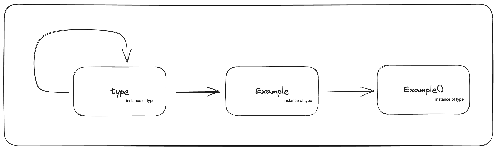

> Even if I create the Example class dynamically, the results will be the same as in my
> previous post.

```python
class Example:
	attr = 1

	def method(self):
		return "method"

name = "Example"
bases = ()
namespace = {
	"attr": 1,
	"method": lambda self: "method"
}

Example = type(name, bases, namespace)

print(f"{Example.__class__=}")     # <class 'type'>
print(f"{Example().attr=}")        # 1
print(f"{Example().method()=}")    # 'method'
```



```python
assert isinstance(Example, type)
assert isinstance(Example(), Example)
```
