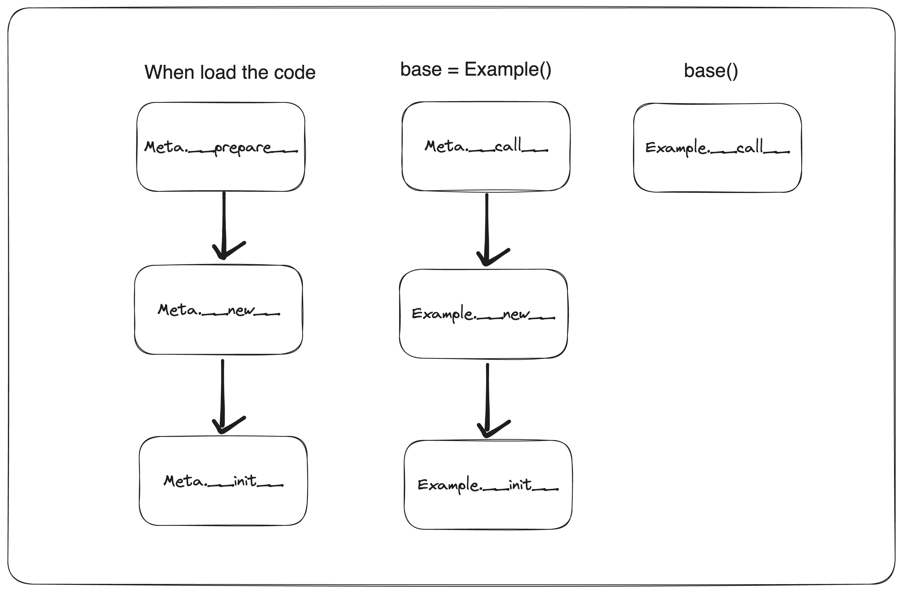

```python
class Meta(type):
    @classmethod
    def __prepare__(mcs, cls_name, bases, **kwargs):  # default, staticmethod
        prepare = super().__prepare__(cls_name, bases)
        print(f"Meta.__prepare__({mcs=}, {cls_name=}, {bases=}, {prepare=})")
        #       Meta.__prepare__(
        #           mcs=<class '__main__.Meta'>,
        #           cls_name='Example',
        #           bases=(<class '__main__.Base'>,),
        #           prepare={}
        #       )
        return prepare

    def __new__(mcs, cls_name, bases, namespace, **kwargs):
        new = super().__new__(mcs, cls_name, bases, namespace)
        print(f"Meta.__new__({mcs=}, {cls_name=}, {bases=}, {namespace=}, {kwargs=}, {new=})")
        #       Meta.__new__(
        #           mcs=<class '__main__.Meta'>,
        #           cls_name='Example',
        #           bases=(<class '__main__.Base'>,),
        #           namespace={'__module__': '__main__', '__qualname__': 'Example', '__new__': <function Example.__new__ at 0x109203c10>, '__init__': <function Example.__init__ at 0x109203ca0>},  # noqa
        #           kwargs={},
        #           new=<class '__main__.Example'> ( self )
        #       )
        return new

    def __init__(cls, cls_name, bases, namespace, **kwargs):
        init = super().__init__(cls_name, bases, namespace, **kwargs)
        print(f"Meta.__init__({cls=}, {cls_name=}, {bases=}, {namespace}, {kwargs=}, {init=})")
        #       Meta.__init__(
        #           cls=<class '__main__.Example'>,  ( self )
        #           cls_name='Example',
        #           bases=(<class '__main__.Base'>,),
        #           namespace={'__module__': '__main__', '__qualname__': 'Example', '__new__': <function Example.__new__ at 0x109203c10>, '__init__': <function Example.__init__ at 0x109203ca0>},  # noqa
        #           kwargs={},
        #           init=None  ( int return None )
        #       )

    def __call__(cls, *args, **kwargs):
        call = super().__call__(*args, **kwargs)
        print(f"Meta.__call__({cls=}, {args=}, {kwargs=}, {call=})")
        #       Meta.__call__(
        #           cls=<class '__main__.Example'>,
        #           args=(1, 2),
        #           kwargs={'c': 3},
        #           call=<__main__.Example object at 0x10d4c3940>
        #       )
        return call


class Base:
    pass


class Example(Base, metaclass=Meta):
    def __new__(cls, *args, **kwargs):
        new = super().__new__(cls)
        print(f"Example.__new__({cls=}, {args=}, {kwargs=}, {new=})")
        #       Example.__new__(
        #           cls=<class '__main__.Example'>,
        #           args=(1, 2)
        #           kwargs={'c': 3},
        #           new=<__main__.Example object at 0x109226a90>
        #       )
        return new

    def __init__(self, a, b, c):
        print(f"Example.__init__({self=}, {a=}, {b=}, {c=})")
        #       Example.__init__(
        #           self=<__main__.Example object at 0x10dd9e940>,
        #           a=1,
        #           b=2,
        #           c=3
        #       )
        self.a = a
        self.b = b
        self.c = c

    def __call__(self, *args, **kwargs):
        print(f"Example.__call__({self=}, {args=}, {kwargs=})")
        #       Example.__call__(
        #           self=<__main__.Example object at 0x10b2eea90>,
        #           args=(1,),
        #           kwargs={'k': 1}
        #       )


base = Example(1, 2, c=3)
base(1, k=1)
```
